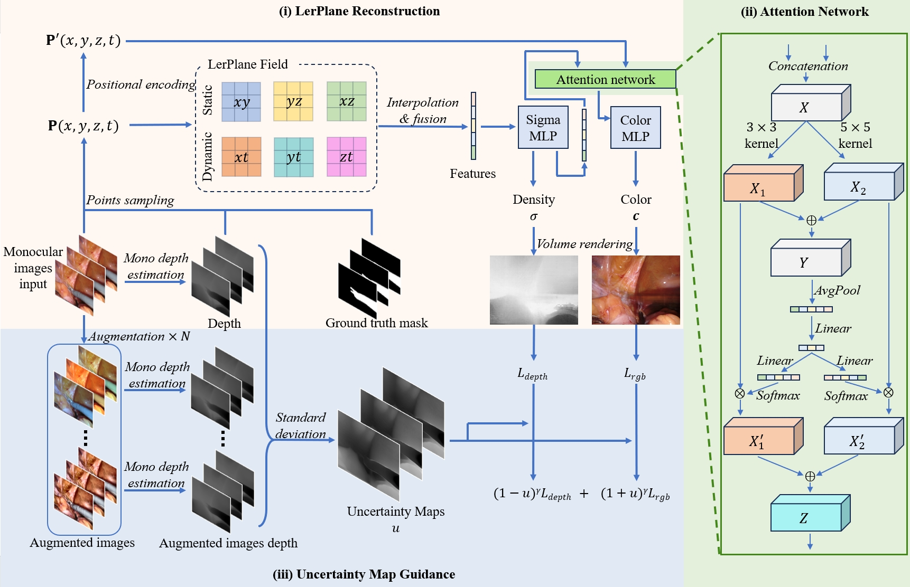

# DAUA-Plane



## Schedule
- [x] Initial Code Release.


## Set up Python environment
Tested with an Ubuntu workstation with RTX A6000 GPU.

```
conda create -n daua python=3.9
conda activate daua
pip install -r requirements.txt
pip install git+https://github.com/NVlabs/tiny-cuda-nn/#subdirectory=bindings/torch
```


## Set up datasets
Please download the dataset from [EndoNeRF](https://github.com/med-air/EndoNeRF), and organize it as:
```
data
| - endonerf_full_datasets
|   | - cutting_tissues_twice
|   | - pushing_soft_tissues
```

Go to the folder `/data_preprocess` and download depth anything large model from [Depth-Anything](https://huggingface.co/LiheYoung/depth-anything-large-hf/tree/main), organize it as:
```
data_preprocess
| - depth-anything-large-hf
|   | - config.json
|   | - gitattributes
|   | - model.safetensors
|   | - preprocessor_config.json
|   | - README.md
```

Change the line 43 in `/data_preprocess/gen_um.py` to dataset you want to preprocess, and run the code to generate monocular depth by depth anything and generate uncertainty map:
```
cd data_preprocess
python gen_um.py
```
Now the dataset will become:
```
data
| - endonerf_full_datasets
|   | - cutting_tissues_twice
|   |   | - depth
|   |   | - **depth_DAM**
|   |   | - gt_masks
|   |   | - images
|   |   | - images_right
|   |   | - masks
|   |   | - **uncer_map**
|   |   | - poses_bounds.npy
```
Change the new depth folder name from `depth_DAM` to `gt_depth`:
```
data
| - endonerf_full_datasets
|   | - cutting_tissues_twice
|   |   | - depth
|   |   | - **gt_depth**
|   |   | - gt_masks
|   |   | - images
|   |   | - images_right
|   |   | - masks
|   |   | - uncer_map
|   |   | - poses_bounds.npy
```

## Training
DAUA-Plane uses configs to control the training process. The example configs are stored in the `lerplanes/config` folder.
To train a model, run the following command in the directory `/DAUA-Plane`:
```
export CUDA_VISIBLE_DEVICES=0
PYTHONPATH='.' python lerplanes/main.py --config-path lerplanes/config/cutting-9k.py
```

## Evaluation
We use the same evaluation protocol as [EndoNeRF](https://github.com/med-air/EndoNeRF). So please follow the instructions in EndoNeRF.

## Acknowledgements
We would like to acknowledge the following inspiring work:
- [LerPlane](https://github.com/Loping151/ForPlane) (Yang et al.)
- [EndoNeRF](https://github.com/med-air/EndoNeRF) (Wang et al.)
- [K-Planes](https://sarafridov.github.io/K-Planes/) (Fridovich-Keil et al.)

Big thanks to [NeRFAcc](https://www.nerfacc.com/) (Li et al.) for their efficient implementation, which has significantly accelerated our rendering.
